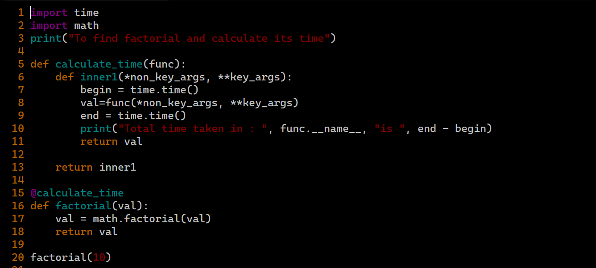

You can use decorators in Python in various situations like:
    1. Need to modify the behavior of a function or class
    2. Can be used to wrap a function, extend its behavior without permanently modifying it.

In decorators, functions are the arguments of another function.

You can see an example of decorators:

